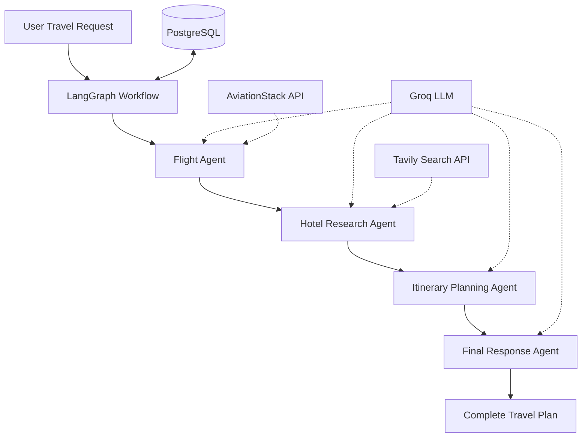

# ✈️ TripMate AI — Multi-Agent Travel Planner

An AI-powered travel planning application that transforms natural-language travel requests into personalized trip plans using a collaborative multi-agent architecture.

Built with **LangGraph, LangChain, Groq, FastAPI, PostgreSQL, Tavily, and AviationStack**, TripMate AI coordinates specialized agents to research flights, discover hotels, and generate structured day-by-day itineraries.

---

## 🌍 Overview

Planning a trip often requires switching between multiple platforms to research flights, hotels, destinations, and activities.

TripMate AI simplifies this process by bringing these capabilities together into a single intelligent application.

Users can submit a natural-language request describing their destination, travel duration, origin, and preferences. The system processes the request through a LangGraph workflow, where specialized agents collaborate to generate a comprehensive travel plan.

The application also uses PostgreSQL-backed checkpointing to preserve conversation state and support continued interactions.

---

## ✨ Features

- 🤖 **Multi-Agent AI Architecture** — Specialized agents collaborate through LangGraph workflows.
- ✈️ **Flight Research** — Flight-related information retrieved using AviationStack integration.
- 🏨 **Hotel Discovery** — Accommodation research powered by Tavily Search.
- 🗓️ **Personalized Itineraries** — AI-generated day-by-day travel schedules.
- 💬 **Natural Language Interaction** — Describe your travel requirements in plain English.
- 🧠 **LLM-Powered Intelligence** — Groq models generate contextual travel recommendations.
- 💾 **Persistent Conversation Memory** — PostgreSQL checkpointing using LangGraph's PostgresSaver.
- 🔄 **Stateful Workflows** — Maintain conversation context across interactions.
- 🌐 **Web Interface** — Interactive frontend for submitting travel requests and viewing results.
- 🚀 **Cloud Deployment Ready** — Configurable for deployment using Render and Docker.

---

## 🧠 Multi-Agent Architecture

TripMate AI uses a sequential multi-agent workflow in which each agent performs a specialized task and passes its results through shared graph state.

### Workflow



### Agent Responsibilities

| Agent | Responsibility |
|---|---|
| Flight Agent | Retrieves flight-related information |
| Hotel Agent | Researches accommodation options and travel information |
| Itinerary Agent | Creates a personalized day-by-day schedule |
| Final Response Agent | Combines research into a structured travel plan |

### How It Works

1. The user submits a travel request.
2. The LangGraph workflow initializes the shared state.
3. The Flight Agent gathers relevant flight information.
4. The Hotel Agent researches accommodation options.
5. The Itinerary Agent generates a travel schedule based on the collected information.
6. The Final Response Agent synthesizes the results into a readable travel plan.
7. PostgreSQL checkpointing maintains conversation state.

---

## 🛠️ Tech Stack

| Category | Technologies |
|---|---|
| Programming Language | Python |
| LLM Provider | Groq |
| LLM Integration | LangChain |
| Agent Orchestration | LangGraph |
| Backend | FastAPI |
| Database | PostgreSQL |
| Conversation Memory | LangGraph PostgresSaver |
| Flight Research | AviationStack |
| Web Search | Tavily API |
| Frontend | HTML, CSS, JavaScript, Jinja2 |
| Database Driver | Psycopg 3 |
| Deployment | Render, Docker |
| Environment Management | python-dotenv |

---

## 📁 Project Structure

```text
TripMate-AI/
│
├── app.py                  # FastAPI application entry point
├── backend.py              # LangGraph multi-agent workflow
├── requirements.txt        # Python dependencies
├── Dockerfile              # Docker configuration
├── .env                    # Environment variables (not committed)
├── .gitignore              # Git ignored files
│
├── tools/
│   ├── __init__.py
│   ├── flight_tool.py      # Flight search integration
│   └── tavily_tool.py      # Web search integration
│
├── static/
│   ├── script.js           # Frontend JavaScript
│   └── style.css           # Application styling
│
├── templates/
│   └── index.html          # Main application interface
│
└── README.md
```

---

## ⚙️ Getting Started

Follow these steps to run TripMate AI locally.

### Prerequisites

Make sure you have installed:

- Python 3.10 or higher
- Git
- VS Code
- PostgreSQL database (local or hosted)
- Groq API key
- Tavily API key
- AviationStack API key

### 1. Clone the Repository

```bash
git clone https://github.com/Kavyaagarwal0008/TripMate-AI.git

cd TripMate-AI
```

### 2. Create a Virtual Environment

```bash
conda create -n travel python=3.11 -y
```

Activate it on Windows:

```powershell
.\travel\Scripts\Activate.ps1
```

If you are using Command Prompt:

```cmd
conda activate travel
```

### 3. Install Dependencies

```bash
pip install -r requirements.txt
```

### 4. Configure Environment Variables

Create a `.env` file in the project root directory.

Add the following configuration:

```env
GROQ_API_KEY=your_groq_api_key

TAVILY_API_KEY=your_tavily_api_key

AVIATIONSTACK_API_KEY=your_aviationstack_api_key

DATABASE_URL=your_postgresql_connection_string
```

Replace the placeholders with your actual credentials.

**Important:** Never upload your `.env` file or expose API keys in a public repository.

### 5. Run the Application

Start the FastAPI application:

```bash
python -m uvicorn app:app --reload --port 8000
```

Open your browser and navigate to:

```text
http://127.0.0.1:8000
```

---

## 💬 Example Travel Request

```text
Plan a 5-day trip to Switzerland from New Delhi.

Include:
- Flight information
- Hotel recommendations
- Popular tourist attractions
- A day-by-day itinerary
- Estimated travel expenses
```

### Expected Output

The application generates a structured travel plan containing relevant flight research, accommodation suggestions, destination information, and a day-wise itinerary.

<sub>Actual results depend on API availability, user requirements, and the information returned by external services.</sub>

---

## 🗄️ Database and Memory

TripMate AI uses PostgreSQL with LangGraph's `PostgresSaver` to maintain workflow checkpoints.

This enables:

- Persistent conversation state
- Continuation of previous conversations
- Storage of graph execution checkpoints
- Stateful multi-turn travel planning

For hosted PostgreSQL services such as Render, configure the external database connection string in `DATABASE_URL`.

The application uses SSL when connecting to hosted PostgreSQL databases where required.

---

## 🚀 Deployment

The application can be deployed using Render.

### Deployment Steps

1. Push the project to GitHub.
2. Create a new Web Service on Render.
3. Connect your GitHub repository.
4. Configure the required environment variables in the Render dashboard.
5. Configure the build and start commands according to the project.
6. Deploy the application.

Do not include database credentials or API keys directly in source code or Docker images.

---

## 🔐 Security Considerations

- Keep API keys inside environment variables.
- Exclude `.env` from Git commits.
- Use SSL for hosted PostgreSQL connections.
- Avoid logging database credentials.
- Validate external API responses before using them in generated plans.

---

## 🔮 Future Enhancements

- 🌦️ Weather forecasting integration
- 💰 Intelligent budget optimization
- 🗺️ Interactive maps and route planning
- 🍽️ Restaurant recommendation agent
- 📄 Downloadable PDF itineraries
- 🌍 Multi-city travel planning
- 👤 User authentication and personalized preferences
- 📅 Calendar integration

---

## 🎯 Key Learning Outcomes

Through this project, I explored:

- Designing multi-agent AI systems using LangGraph.
- Building stateful workflows with shared graph state.
- Integrating LLMs with external APIs and tools.
- Implementing persistent conversation memory with PostgreSQL.
- Developing backend applications using FastAPI.
- Managing environment variables and external service integrations.
- Structuring an AI application for cloud deployment.

---

## 👩‍💻 Author

**Kavya Agarwal**

B.Tech CSE-AIML | GL Bajaj Institute of Technology and Management

- GitHub: [Kavyaagarwal0008](https://github.com/Kavyaagarwal0008)
- LinkedIn: [Connect with me](https://www.linkedin.com/)

---

## 🙏 Acknowledgements

This project was developed as a hands-on exploration of multi-agent AI systems, LangGraph orchestration, LLM integrations, and real-world travel automation.

**Tutorial Reference:** [Build TripMate AI End-to-End — Multi-Agent Travel Planner](https://youtu.be/rygTO5F_KWE)

---

## 📄 License

This project is intended for educational and learning purposes.

